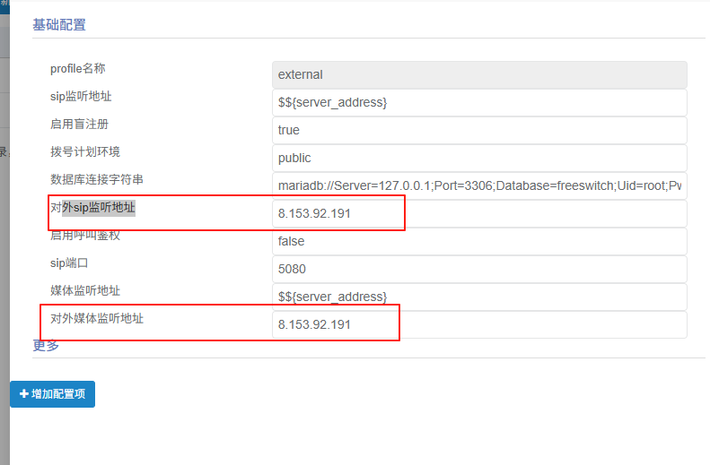

## easycallcenter365常见问题及解决办法

### 通话30多秒后自动挂机

a. 在后台找到菜单"profile管理"，参考下图。
   
   
b. 选择external，点击修改。   
   
   
c. 修改参数 "对外监听SIP地址" 和 "对外媒体监听地址"。
   
   
d. 使用软电话注册到 `5080` 端口， 注意不是 `5060` 端口。   

### 如何设置分机相互拨打

默认没有开启分机相互拨打的路由，因为分机的调度是通过呼叫中心内部实现的。
正常情况不需要设置，否则会影响呼叫中心的调度。

如果需要设置分机相互拨打，请参考一下步骤。

a. 进入目录: cd `/home/freeswitch/etc/freeswitch/dialplan`
b. 删除文件: rm -rf default.xml 
c. 下载文件[default.xml](https://gitee.com/easycallcenter365/freeswitch-modules-libs/blob/master/FreeSWITCH-Config-Files/conf/dialplan/default.xml) ， 并上传到 `/home/freeswitch/etc/freeswitch/dialplan` 目录下。
d. 刷新`FreeSWITCH`配置： docker exec -it freeswitch-debian12 /usr/local/freeswitchvideo/bin/fs_cli -x reloadxml

