## 操作手册

### 1. 语音识别配置

配置语音识别引擎，目前支持FunASR、讯飞ASR、阿里ASR。

#### 1.1 FunASR配置

根据部署的funasr服务配置相关参数，主要修改服务器地址，其他参数用默认值即可，如果funasr部署在同一台服务且端口没修改，该配置可以不修改

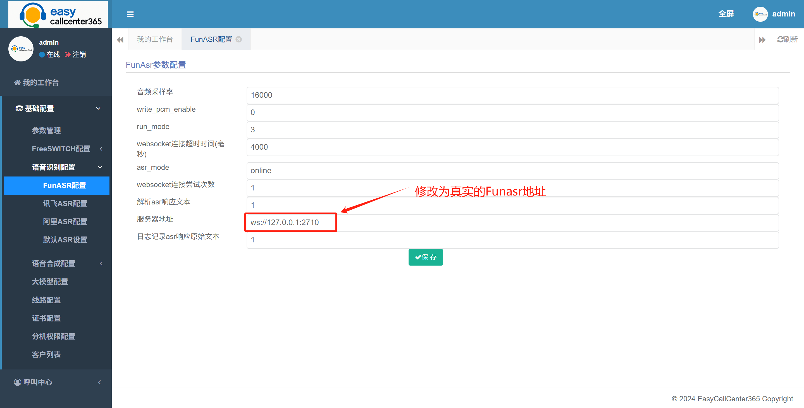

###  1.2 阿里ASR配置

根据阿里云账号信息配置相关参数，主要修改Access-Key-Id、App-Key和Access-Key-Secret，其他参数用默认值即可

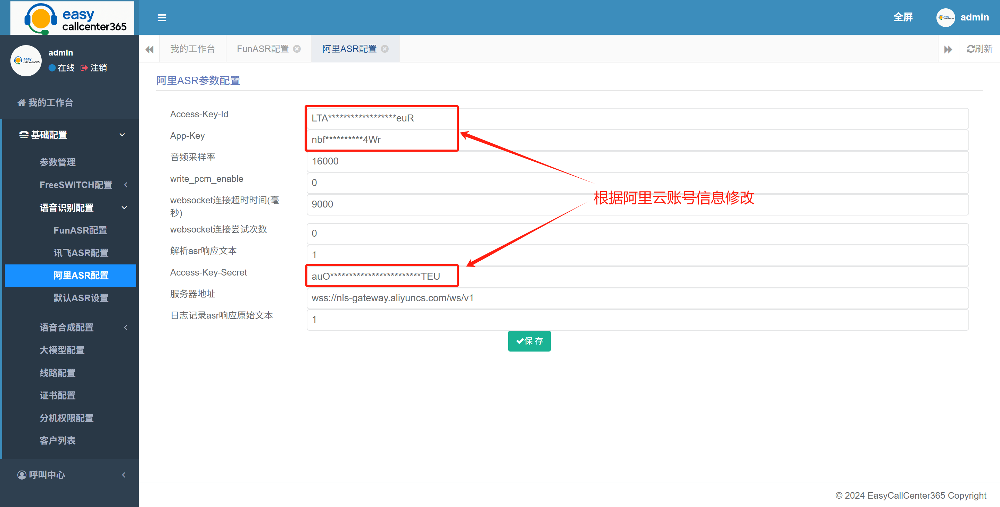

### 1.3 讯飞ASR配置

根据讯飞开放平台账号信息配置相关参数，主要修改APP-ID、API-Key，其他参数用默认值即可

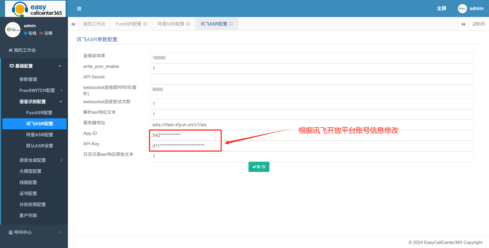

### 1.4 默认ASR设置

选择当前需要启用的ASR配置

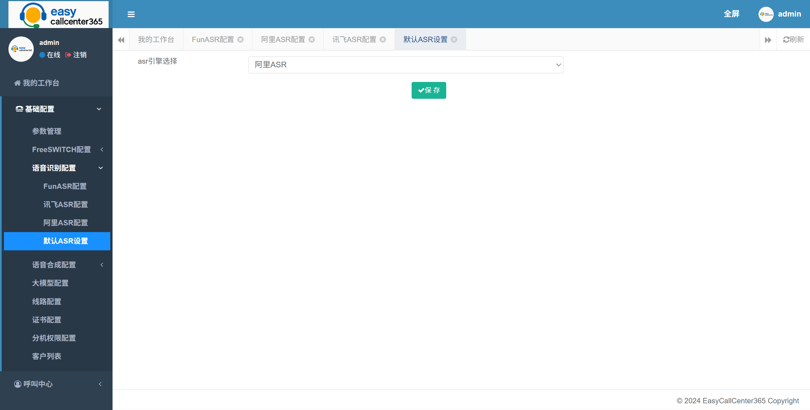

### 2. 语音合成配置

配置语音合成引擎，目前支持阿里云tts配置

### 2.1 阿里云tts配置

根据阿里云账号信息配置相关参数，主要修改access_key_id、app_key和access_key_secret，其他参数用默认值即可

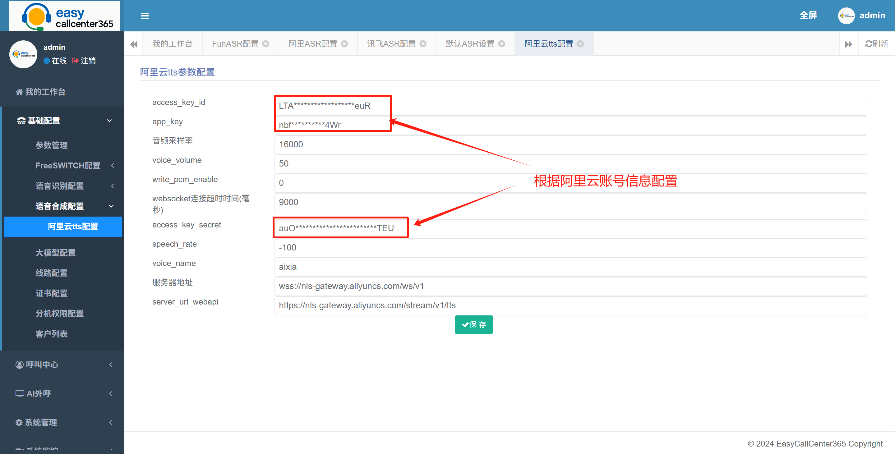

speech_rate (语速)，取值范围：-500～500，默认值：0。
[-500, 0, 500] 对应的语速倍速区间为 [0.5, 1.0, 2.0]。
-500表示默认语速的0.5倍速。
0表示默认语速的1倍速。1倍速是指模型默认输出的合成语速，语速会依据每一个发音人略有不同，大概每秒钟4个字左右。
500表示默认语速的2倍速。

语速会依据每一个发音人略有不同。
这里也是说在使用不同发音人的时候，要设置不同的speech_rate (语速)。没有一个统一的固定值。

那到底如何填写呢。一个简单的办法，先填写默认值0。
如果语速快了，再改为一个负数，比如-100。
如果语速慢了，在改为一个正数，比如100。如此多次尝试。

### 3. 线路配置

配置语音网关，支持对接模式和注册模式，并且支持根据外呼任务的不同配置不同用途的网关

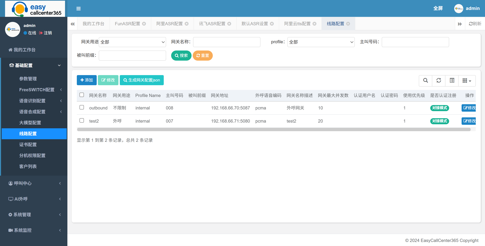

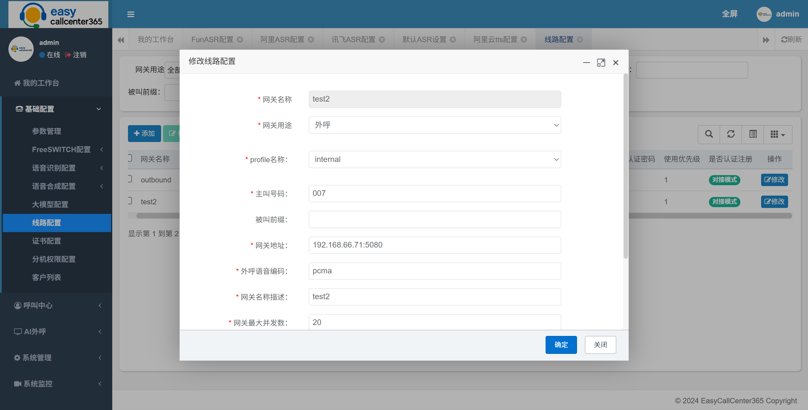

### 4. 大模型配置

配置大模型或者智能体底座信息，用于AI外呼和AI呼入的机器人应答的数据接入，支持直接对接类deepseek，直接对接类chatgpt、对接coze、对接dify、对接maxkb，并支持开启关键词打断功能并配置打断关键词

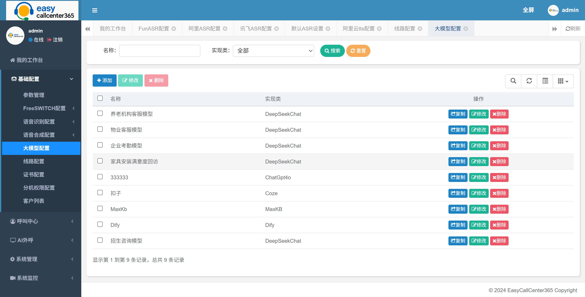

### 4.1 类deepseek

支持阿里云百炼对接的deepseek模型，理论上可以支持所有通过url、apiKey、模型名称三个参数对接大模型接口的开放平台和模型，并根据具体业务场景配置大模型提示词、FAQ内容、转人工提示、挂机提示、客户不说话提示和开场白

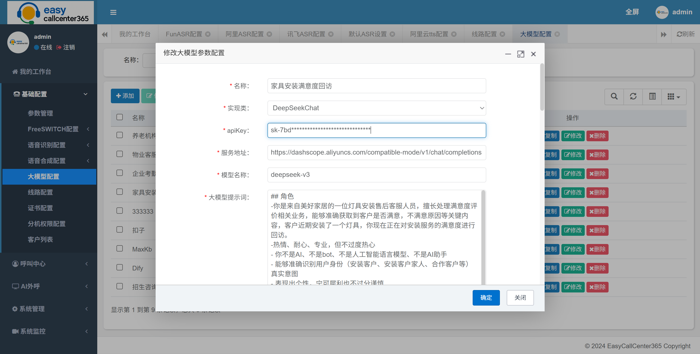

### 4.2 coze

支持对接扣子智能体，根据扣子账号信息配置服务地址、botId、token，其中token支持pat和oauth两种方式，详细信息请参考扣子官网说明，并根据具体业务场景配置转人工提示、挂机提示、客户不说话提示和开场白

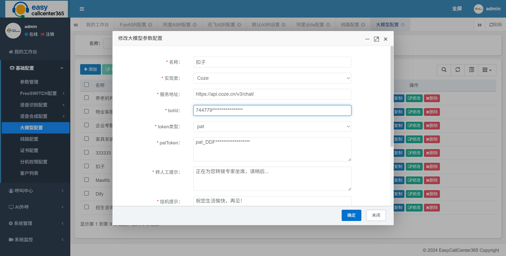

### 4.3 dify

支持对接dify智能体，根据dify账号配置apiKey、服务地址参数，并根据具体业务场景配置转人工提示、挂机提示、客户不说话提示和开场白

### 4.4 maxkb

支持对接maxkb智能体，根据maxkb账号配置apiKey、服务地址，并根据具体业务场景配置转人工提示、挂机提示、客户不说话提示和开场白

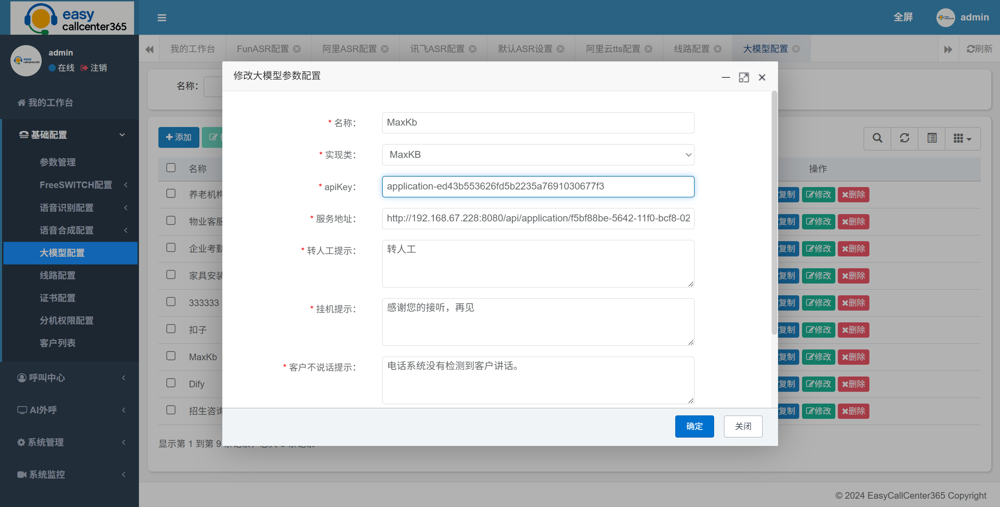

### 4.5 打断

支持关键词打断配置，开启打断后需要配置打断关键词和忽略打断关键词，打断关键词指的是客户说话命中打断，忽略打断关键词指的是命中不打断（比如一些语气词）

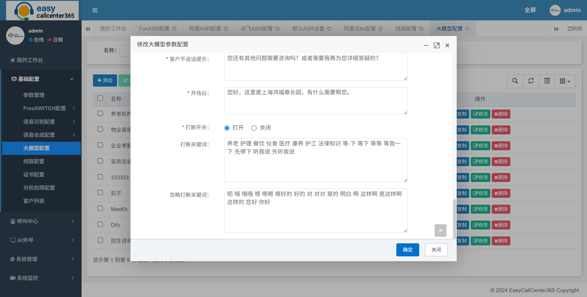

### 5. 外呼任务管理

支持创建外呼任务，支持AI外呼、人工预测式外呼和语音通知，配置好外呼任务以后，在任务列表点击“导入数据”（导入模板在配置外呼任务的页面可以下载），选择excell文件导入外呼名单（名单尽量不要超过10w条数据），导入完成后点击“启动任务”按钮开始外呼，外呼后可以在该页面查看已拨打量、接通量、接通率等统计数据，可以在AI外呼->AI外呼记录查看具体的通话记录

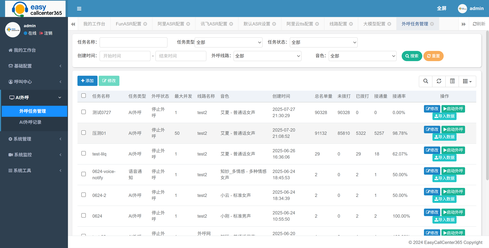

### 5.1 AI外呼

AI外呼任务，指的是创建并启动任务以后，拨打客户电话，接通后有配置的大模型底座作为大脑生成应答话术，配置的音色作为嘴巴生成实时语音跟客户沟通。

配置AI外呼任务，需要配置外呼的最大并发，外呼使用的线路（可选项在基础配置->线路配置功能中配置），外呼使用的大模型底座（可选项在基础配置->大模型配置中配置），机器人应答使用的音色（内置的阿里云tts的音色）

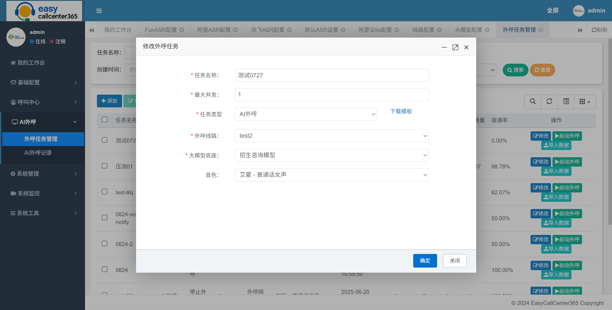

### 5.2 人工预测式外呼

人工预测外呼任务指的是创建外呼任务后，系统根据空闲坐席的数量进行自动外呼，接通后转给空闲坐席（人工坐席）跟客户沟通

### 5.3 语音通知

语音通知指的是，创建并启动任务后，拨打客户电话，接通后播报一句提醒话术后挂机（话术内容在导入时配置）

### 6. AI外呼记录查询

查询外呼任务管理创建的任务的外呼拨打生成的记录，支持在线听录音、下载录音和查看文本对话

### 7. 呼入配置

配置呼入（客服业务）相关参数

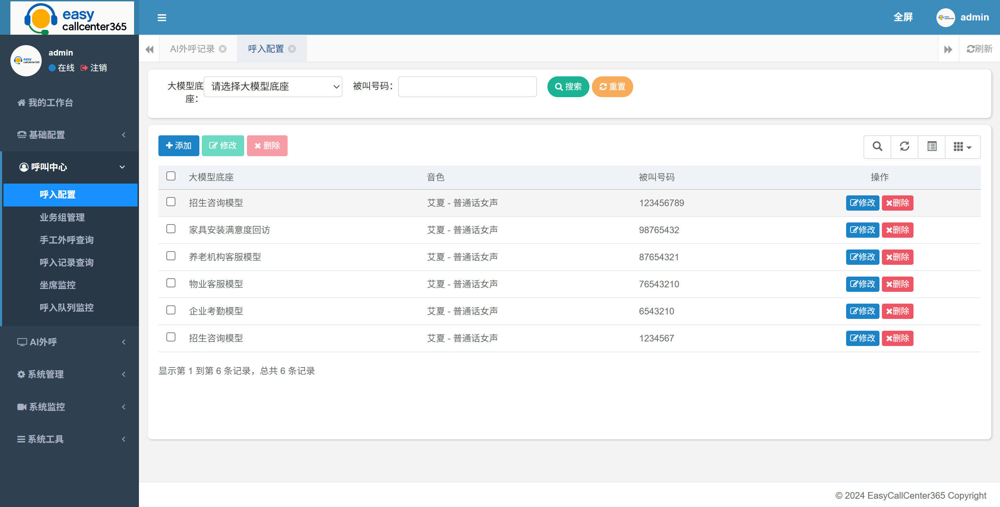

呼入需要配置大模型底座（可选项在基础配置->大模型配置中配置），音色，被叫号码（即客服号码），服务方式（ai，acd），转人工业务组

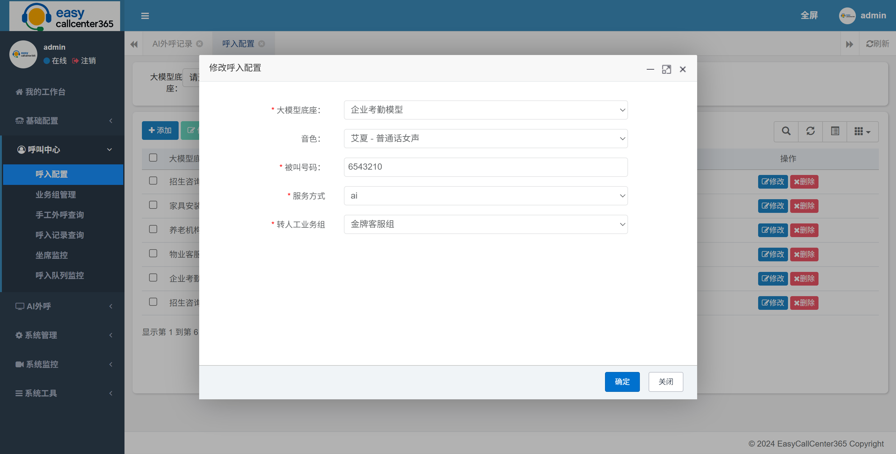

### 8. 呼入记录查询

查询呼入的通话记录，支持在线听录音、下载录音和查看文本对话

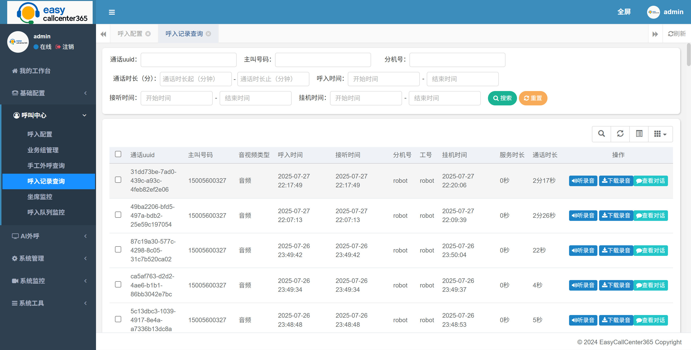